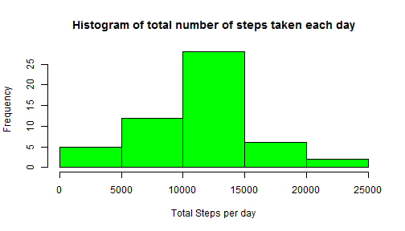
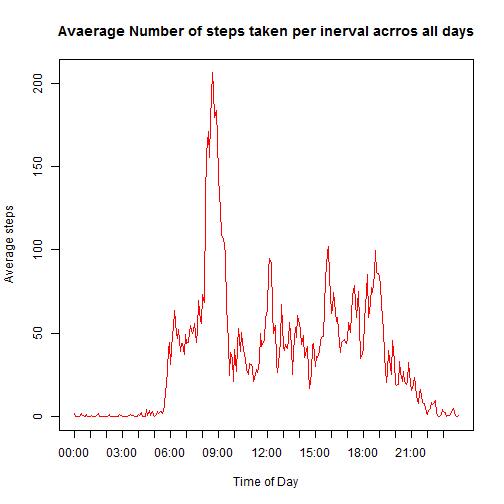
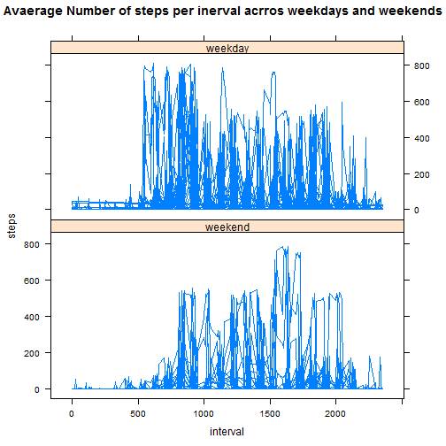

<center> <h1>Peer Assessment 1</h1> </center>

========================================================

## Introducction
This assignment makes use of data from a personal activity monitoring device. This device collects data at 5 minute intervals through out the day. The data consists of two months of data from an anonymous individual collected during the months of October and November, 2012 and include the number of steps taken in 5 minute intervals each day

### Loading and preprocessing the data
I have loaded the data to the variable **activity** and changed the class of variable date to ***Date***.


```r
setwd("C:\\Users\\i308429.GLOBAL\\Downloads\\Data Science\\C5\\pa1")
library(lattice)
activity <- read.csv("activity.csv")
activity$date <- as.Date(activity$date)
```


### Mean total number of steps taken per day
The variaable **total_steps_per_day** is a data frame with 2 coloumns *steps* and *date*. The *steps* coloumn contains the total number of steps taken per each day.
I have used the **aggregate** function to calculate the total number of steps taken per day.

```r
total_steps_per_day <- aggregate(steps ~ date, activity, sum)
mean <- mean(total_steps_per_day$steps)
median <- median(total_steps_per_day$steps)
```


The mean of total number of steps taken per day is **1.0766 &times; 10<sup>4</sup>** and the median of total number of steps taken per day is **10765**.


```r
hist(total_steps_per_day$steps, xlab = "Total Steps per day", main = "Histogram of total number of steps taken each day", 
    col = "green")
```

 

The above is a Histogram of total number of steps taken per each day.

### The average daily activity pattern
I have created a new data frame **Average_steps_per_interval** which contains average number of steps taken per each interval averaged across all the days in the data set *activity*.
I have added a new coloumn with the formatted interval using the function **strptime**.

```r
Average_steps_per_interval <- aggregate(steps ~ interval, activity, FUN = "mean")
stringformat <- sprintf("%04d", Average_steps_per_interval$interval)
Average_steps_per_interval$interval_formated <- format(strptime(stringformat, 
    format = "%H%M"), format = "%H:%M")
plot(Average_steps_per_interval$steps, xaxt = "n", type = "l", col = "red", 
    xlab = "Time of Day", ylab = "Average steps", main = "Avaerage Number of steps taken per inerval acrros all days")
axis(1, at = seq(1, 288, by = 12), labels = Average_steps_per_interval$interval_formated[seq(1, 
    288, by = 12)])
```

 

The Above plot is a time series plot of the 5-minute interval (x-axis) and the average number of steps taken, averaged across all days (y-axis).

```r
max_steps_interval <- Average_steps_per_interval[which(Average_steps_per_interval$steps == 
    max(Average_steps_per_interval$steps), arr.ind = TRUE), ]
```

**08:35** interval on an average across all the days in the dataset, contains the maximum number of steps **206.1698**.

### Imputing missing values 


```r
total_missing_values <- sum(is.na(activity$steps))
```

The total number of missing values in the dataset *activity* is 2304 .

In the below code i have created a new dataframe *new_data* where i have replaced all the **NA** with the mean for that 5 minute interval that was calculated in the last section in dataframe ***Average_steps_per_interval***.
I have first calculated the missing indexes in variable *missing_index* and then the interval for all these missing indexes in the variable *interval_missing_index*.
I have used a for loop to get the average steps for the missing index's interval and have replaced the **NA** with mean steps of the corresponding interval.

```r
new_data <- activity
missing_index <- which(is.na(new_data$steps))
interval_missing_index <- new_data$interval[missing_index]
x <- c()
for (i in interval_missing_index) {
    c <- which(i == Average_steps_per_interval$interval)
    x <- c(x, c)
}
new_data$steps <- replace(new_data$steps, missing_index, Average_steps_per_interval[x, 
    2])
```


### Activity patterns between weekdays and weekends
I have added a new coloumn to the data frame *new_data* that was created in the last section indicating whether a given date is a weekday or weekend day by using the function **weekdays** and **%in%**. Then I have used the aggregate function to calculate average number of steps taken per each interval averaged across all the days in the data set *new_data*.

I have used the **lattice** plotting system to make a panel plot containing a time series plot of the 5-minute interval (x-axis) and the average number of steps taken, averaged across all weekday days or weekend days (y-axis).


```r
wdays <- c("Monday", "Tuesday", "Wednesday", "Thursday", "Friday")
new_data$day <- factor((weekdays(new_data$date) %in% wdays), levels = c(FALSE, 
    TRUE), labels = c("weekend", "weekday"))
Average_steps_interval <- aggregate(steps ~ interval, new_data, FUN = "mean")

xyplot(steps ~ interval | day, data = new_data, layout = c(1, 2), type = "l", 
    main = "Avaerage Number of steps per inerval acrros weekdays and weekends")
```

 

Panel plot containing time series plot of the 5-minute interval (x-axis) and the average number of steps taken, averaged across all weekday days or weekend days (y-axis).
